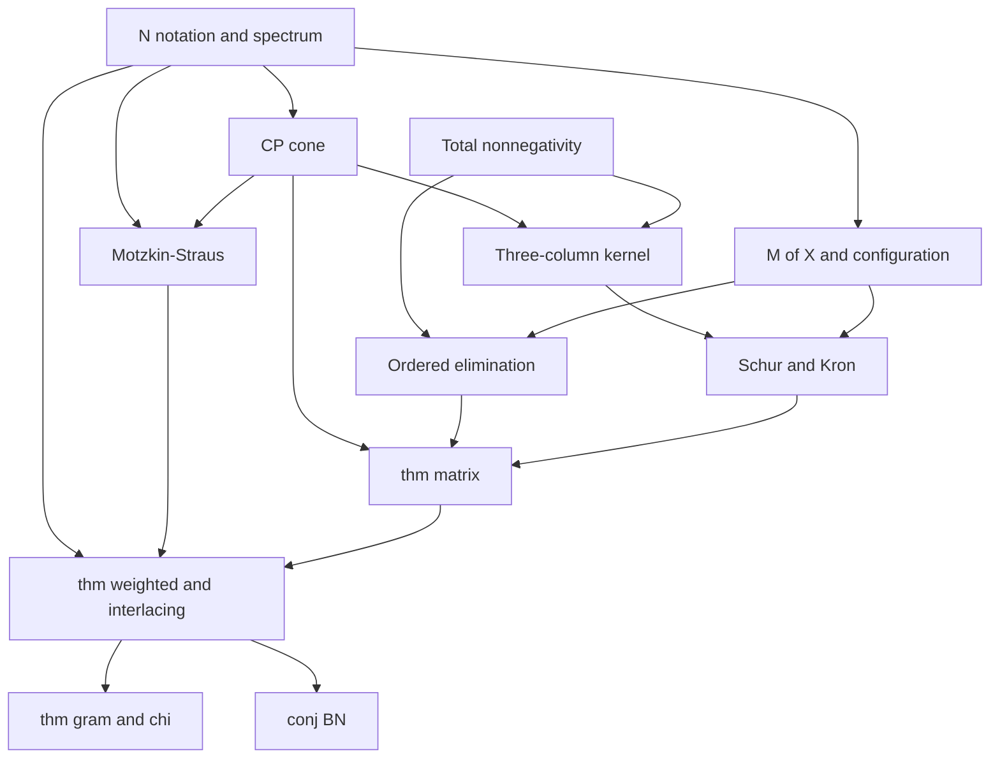

# Formalization DAG

Source: [`sol.tex`](sol.tex). Public target: `BN.lambda1_sq_add_lambda2_sq_le` in `BN/Main.lean` (`conj:BN`).

Each **node is one lemma or definition**. A node is ready for a subagent only when every dependency is `done`. Given those dependencies, the node should be a short Lean task (definitions, a calculation, a case split, or assembling named lemmas). Do not fold a dependency’s proof into a downstream node.

Status: `done` (compiles, no `sorry`), `sorry` (stated), `open` (not started), `wip` (claimed by a subagent).

## Agent protocol

1. Pick a source of the induced subgraph of `open`/`sorry` nodes whose dependencies are all `done`.
2. Formalize **only that node**. Do not start a dependent node in the same pass.
3. Put the statement in the suggested module; reuse existing names from `BN/Definition.lean`.
4. Do not add `sorry` in a node marked `done`. Downstream `sorry` (the public theorem) is allowed until its own node is closed.
5. After the node compiles, mark it `done` in the catalog below.

## Conventions

- Finite simple graphs: `SimpleGraph V` with `[Fintype V] [DecidableEq V] [DecidableRel G.Adj]`.
- Complete graph: `⊤`. Noncomplete: `G ≠ ⊤`. At least two vertices: `[Nontrivial V]`.
- Ordered eigenvalues of a real symmetric matrix: Mathlib `Matrix.IsHermitian.eigenvalues₀` (antitone on `Fin n`). The paper’s `λ_{i+1}` is index `i`.
- `B ⪰ 0` is `Matrix.PosSemidef`. `B ≥ 0` is entrywise `0 ≤ B i j`.
- Hadamard product is `⊙`. Write `X ∘²` for `X ⊙ X`.
- `t₊ = max t 0`. Entrywise positive part: `(posPart X) i j = max (X i j) 0`.
- Frobenius pairing: `inner B C = (Bᵀ * C).trace`. Then `frobeniusSq B = inner B B`.
- Completely positive: `IsCompletelyPositive C` means `∃ p : Fin q → V → ℝ, (∀ a i, 0 ≤ p a i) ∧ C = ∑ a, vecMulVec (p a) (p a)` (any `q`).
- Totally nonnegative: every square submatrix (equivalently, every minor from increasing index lists) has nonnegative determinant.
- Configuration indices in §4: implement as `ι = Option (Fin k) ⊕ Fin p`, with `none` the distinguished vertex `0`, `some i` a `z`-index, `Sum.inr j` a `y`-index. Do not switch encodings mid-stream.
- Mathlib already has: Hermitian `eigenvalues₀`, Rayleigh maximizers as eigenvectors (`Analysis.InnerProductSpace.Rayleigh`), Schur complements (`PosSemidef.fromBlocks₁₁`), Cramer (`mulVec_cramer`), matrix determinant lemma (`det_add_mul`, `det_one_add_mul_comm`), Hadamard product, `cliqueNum`, `edgeFinset`. It does **not** have the CP cone, Motzkin–Straus, total nonnegativity, Perron for symmetric nonnegative matrices, or Cauchy interlacing; those are nodes below.

## Cluster DAG

## Catalog

### N — Notation and spectrum

### N01 — Unordered adjacency eigenvalues

**Status:** done. **Module:** `BN.Definition`. **Deps:** none.

**Statement.** `adjacencyEigenvalues G : V → ℝ` is `(G.isHermitian_adjMatrix ℝ).eigenvalues`.

**Route.** Already in `BN/Definition.lean`.

### N02 — Ordered adjacency eigenvalues

**Status:** done. **Module:** `BN.Definition`. **Deps:** none.

**Statement.** `adjacencyEigenvalues₀ G` is `(G.isHermitian_adjMatrix ℝ).eigenvalues₀`, hence antitone; `lambda1` / `lambda2` are indices `0` and `1`.

**Route.** Already in `BN/Definition.lean`.

### N03 — Ordered eigenvalues of a general Hermitian matrix

**Status:** done. **Module:** `BN.Basic.Spectrum`. **Deps:** none.

**Statement.** For `A : Matrix n n ℝ` with `hA : A.IsHermitian`, write `eigs₀ hA : Fin (Fintype.card n) → ℝ` for `hA.eigenvalues₀`. It is antitone. For `[Nontrivial n]`, set `lambdaMax A = eigs₀ ⟨0,_⟩` and `lambdaSecond A = eigs₀ ⟨1,_⟩`.

**Route.** Wrappers around Mathlib. Use this, not the graph-only API, for a general weight matrix `B`.

### N04 — Two largest positive parts

**Status:** done. **Module:** `BN.Basic.Spectrum`. **Deps:** N03.

**Statement.** `F A` is `(max (lambdaMax A) 0)^2 + (max (lambdaSecond A) 0)^2` when `[Nontrivial n]`, and `(max (lambdaMax A) 0)^2` when `Fintype.card n = 1`.

**Route.** `by_cases` on `Nontrivial n`. Missing eigenvalues are zero, matching `sol.tex` p. 95–96.

### N05 — `F` is nonnegative and `F 0 = 0`

**Status:** done. **Module:** `BN.Basic.Spectrum`. **Deps:** N04.

**Statement.** `0 ≤ F A` and `F 0 = 0`.

**Route.** `sq_nonneg` and `eigenvalues_eq_zero_iff`.

### N06 — Frobenius pairing

**Status:** done. **Module:** `BN.Basic.Inner`. **Deps:** none.

**Statement.** `inner B C = ((B.transpose * C).trace : ℝ)` for `B C : Matrix n n ℝ`. This is a symmetric bilinear form, and `inner B B = ∑ i, ∑ j, B i j ^ 2`.

**Route.** Unfold `trace` and `mul`; use `B.IsSymm` only when needed later. Do not assume symmetry in this node.

### N07 — Frobenius–Hadamard identity

**Status:** done. **Module:** `BN.Basic.Inner`. **Deps:** N06.

**Statement.** If `B` is symmetric, `inner B C = ∑ i, ∑ j, B i j * C i j`.

**Route.** `trace_transpose_mul` and symmetry of `B`.

### N08 — Entrywise positive part

**Status:** done. **Module:** `BN.Basic.Inner`. **Deps:** none.

**Statement.** `posPart X i j = max (X i j) 0`. Then `0 ≤ posPart X` entrywise, and `posPart X i j = X i j` on `{X i j ≥ 0}`.

**Route.** `max_eq_left` / `max_eq_right`.

### N09 — Rank-one Laplacian entries

**Status:** done. **Module:** `BN.Basic.Inner`. **Deps:** none.

**Statement.** For `i ≠ j`, `((single i 1 - single j 1).vecMulVec (single i 1 - single j 1)) a b` equals `1` on `{i,j}²` diagonal, `-1` on the two off-diagonal positions, and `0` elsewhere.

**Route.** Expand `vecMulVec` (`fun a b => u a * v b`).

### N10 — Inner product against a rank-one Laplacian

**Status:** done. **Module:** `BN.Basic.Inner`. **Deps:** N06, N07, N09.

**Statement.** For symmetric `C` and `i ≠ j`, `inner C ((e i - e j).vecMulVec (e i - e j)) = C i i + C j j - 2 * C i j`.

**Route.** Apply N07 and N09.

### N11 — Adjacency Frobenius mass

**Status:** done. **Module:** `BN.Basic.Spectrum`. **Deps:** N06.

**Statement.** `inner (G.adjMatrix ℝ) (G.adjMatrix ℝ) = 2 * (G.edgeFinset.card : ℝ)`.

**Route.** `trace (A^2) = ∑ degrees = 2 |E|` as in `Sq/Spectral.lean` (`sum_degrees_eq_twice_card_edges`).

### N12 — Clique number at least one

**Status:** done. **Module:** `BN.Basic.Graph`. **Deps:** none.

**Statement.** `[Nonempty V] → 1 ≤ G.cliqueNum`. If `G.Adj u v` then `2 ≤ G.cliqueNum`.

**Route.** Copy `SqOmega/Graph.lean` (`one_le_cliqueNum`, `two_le_cliqueNum_of_adj`).

### N13 — Turán factor

**Status:** done. **Module:** `BN.Basic.Graph`. **Deps:** N12.

**Statement.** `turanFactor G = 1 - 1 / (G.cliqueNum : ℝ)`. If `[Nonempty V]` then `0 ≤ turanFactor G`. If `2 ≤ G.cliqueNum` then `0 < turanFactor G`.

**Route.** Copy `SqOmega/Graph.lean`.

### N14 — Schur product of PSD matrices

**Status:** done. **Module:** `BN.Basic.Inner`. **Deps:** none.

**Statement.** If `X.PosSemidef` and `Y.PosSemidef` then `(X ⊙ Y).PosSemidef`. In particular `(X ⊙ X).PosSemidef`.

**Route.** Spectral writing `X = ∑ λ_k vecMulVec u_k u_k` with `λ_k ≥ 0`, so `X ⊙ Y = ∑ λ_k (diagonal u_k) * Y * (diagonal u_k)`, each term PSD. Or Kronecker plus a principal submatrix. Either is fine; do not invent a new PSD theory.

---

### CP — Completely positive cone

### CP01 — Definition

**Status:** done. **Module:** `BN.CP.Basic`. **Deps:** none.

**Statement.** `IsCompletelyPositive C` iff there exist `q` and `p : Fin q → n → ℝ` with `∀ a i, 0 ≤ p a i` and `C = ∑ a, vecMulVec (p a) (p a)`.

**Route.** Definition only. Record that this forces `C.IsHermitian` and entrywise nonnegativity as a later node, not here.

### CP02 — Rank-one generators

**Status:** done. **Module:** `BN.CP.Basic`. **Deps:** CP01.

**Statement.** If `p ≥ 0` entrywise then `vecMulVec p p` is completely positive. Nonnegative scalar multiples of CP matrices are CP. Sums of CP matrices are CP.

**Route.** `q = 1` for rank one; concatenate families for sums.

### CP03 — Equivalent finite factorization

**Status:** done. **Module:** `BN.CP.Basic`. **Deps:** CP01.

**Statement.** `IsCompletelyPositive C` iff `C = A * A.transpose` for some `A : Matrix n r ℝ` with `0 ≤ A` entrywise (some `r`).

**Route.** Columns of `A` are the vectors `p a`.

### CP04 — Entrywise nonnegative and PSD

**Status:** done. **Module:** `BN.CP.Basic`. **Deps:** CP02.

**Statement.** Completely positive matrices are symmetric, PSD, and entrywise nonnegative.

**Route.** Each `vecMulVec p p` is PSD (`dotProduct_mulVec`) and nonnegative if `p` is.

### CP05 — Principal submatrices

**Status:** done. **Module:** `BN.CP.Basic`. **Deps:** CP03.

**Statement.** A principal submatrix of a CP matrix is CP.

**Route.** Restrict rows of the nonnegative factor `A`.

### CP06 — Compact generators

**Status:** done. **Module:** `BN.CP.Closed`. **Deps:** CP02.

**Statement.** The set `S = { vecMulVec p p | p ≥ 0, ∑ i, p i ^ 2 = 1 }` is compact in `Matrix n n ℝ`, and `0 ∉ S`.

**Route.** Continuous image of the compact set `{p ≥ 0 : ‖p‖ = 1}`. Trace is `1` on `S`.

### CP07 — Closed cone

**Status:** done. **Module:** `BN.CP.Closed`. **Deps:** CP01, CP02, CP06.

**Statement.** `{C | IsCompletelyPositive C}` is a closed cone.

**Route.** It is the cone generated by compact `S` not containing `0`. Alternatively: Carathéodory gives `≤ n(n+1)/2` columns; traces bound those columns; pad and pass to a subsequence. Either proof is acceptable; prefer the compact-generator argument if it stays short.

### CP08 — Rank-one pair identity

**Status:** done. **Module:** `BN.CP.Pair`. **Deps:** N09.

**Statement.** If `p ≥ 0`, `a = p i`, `b = p j`, `i ≠ j`, and `a + b > 0`, let `u` (resp. `v`) be `p` with coordinates `(i,j)` replaced by `(a+b, 0)` (resp. `(0, a+b)`). Then
`vecMulVec p p + (a*b) • vecMulVec (e i - e j) (e i - e j) = (a/(a+b)) • vecMulVec u u + (b/(a+b)) • vecMulVec v v`.

**Route.** Compare both sides on the four entries `{i,j}²`; other rows are unchanged. This is the displayed identity in `lem:pair`.

### CP09 — Rank-one pair lemma, `0 ≤ h ≤ a b`

**Status:** done. **Module:** `BN.CP.Pair`. **Deps:** CP08, CP02.

**Statement.** If `p ≥ 0`, `i ≠ j`, and `0 ≤ h ≤ p i * p j`, then `vecMulVec p p + h • vecMulVec (e i - e j) (e i - e j)` is CP.

**Route.** If `p i * p j = 0` then `h = 0`. Otherwise interpolate `h` between `0` and `a b` using CP08 and CP02.

### CP10 — Lemma `lem:pair`

**Status:** done. **Module:** `BN.CP.Pair`. **Deps:** CP09, CP01.

**Statement.** If `C` is CP, `i ≠ j`, and `0 ≤ h ≤ C i j`, then `C + h • vecMulVec (e i - e j) (e i - e j)` is CP.

**Route.** Write `C = ∑ p_a p_aᵀ`. The bounds `p_a i * p_a j` sum to `C i j`, so split `h = ∑ h_a` with `0 ≤ h_a ≤ p_a i p_a j` (greedy / `Finset.sum_le`). Apply CP09 to each summand.

### CP11 — Corollary `cor:laplacian`

**Status:** done. **Module:** `BN.CP.Pair`. **Deps:** CP10, N09.

**Statement.** If `C` is CP, `L` is a weighted Laplacian `∑_{i<j} ℓ_{ij} vecMulVec (e i - e j) (e i - e j)` with `ℓ ≥ 0`, and `C + L` is entrywise nonnegative, then `C + L` is CP.

**Route.** For each pair, `ℓ_{ij} ≤ C i j` by nonnegativity of `C+L` at `(i,j)` (off-diagonal of `L` is `-ℓ_{ij}`). Apply CP10 successively. An update on `{p,q} ≠ {i,j}` does not change the `(i,j)` entry (N09).

---

### MS — Motzkin–Straus

### MS01 — Quadratic form as an edge sum

**Status:** done. **Module:** `BN.MS.Basic`. **Deps:** none.

**Statement.** `mulVec (G.adjMatrix ℝ) y ⬝ᵥ y = ∑ i, ∑ j, (if G.Adj i j then y i * y j else 0)`.

**Route.** `dotProduct_mulVec_adjMatrix`.

### MS02 — Linearity along a nonedge

**Status:** done. **Module:** `BN.MS.Basic`. **Deps:** MS01.

**Statement.** If `¬ G.Adj i j` and `i ≠ j`, then for all `t` with `y i + t ≥ 0` and `y j - t ≥ 0`,
`quadratic (y + t • (single i 1 - single j 1)) = quadratic y + 2 * t * ((A y) i - (A y) j)`.
In particular the second difference is zero.

**Route.** `A i i = A j j = A i j = 0`, so the quadratic in `t` has vanishing `t²` coefficient.

### MS03 — Some maximizer is clique-supported

**Status:** done. **Module:** `BN.MS.Basic`. **Deps:** MS02.

**Statement.** On `{ y ≥ 0 : ∑ y = 1 }`, the continuous function `y ↦ y ⬝ᵥ A y` attains its maximum, and there is a maximizer whose support is a clique.

**Route.** Compact simplex. If `i, j` are both positive and nonadjacent, MS02 is linear in `t`, so a maximizer can be moved until `y i = 0` or `y j = 0`. Repeat (finite support).

### MS04 — Clique computation

**Status:** done. **Module:** `BN.MS.Basic`. **Deps:** MS01.

**Statement.** If `s.IsClique G` and `y` is supported on `s`, then `y ⬝ᵥ A y = (∑ y)^2 - ∑ i, y i ^ 2`.

**Route.** `(∑ y)^2 = ∑ y_i^2 + ∑_{i ≠ j} y_i y_j` and off-diagonal pairs in `s` are edges.

### MS05 — Cauchy–Schwarz on a simplex of size `k`

**Status:** done. **Module:** `BN.MS.Basic`. **Deps:** none.

**Statement.** For `y : Fin k → ℝ`, `(∑ y)^2 ≤ k * ∑ y i ^ 2`, hence `(∑ y)^2 - ∑ y^2 ≤ (1 - 1/k) (∑ y)^2` when `k ≥ 1`.

**Route.** Cauchy–Schwarz on `⟨y, 1⟩`. If `k = 0` the claim is vacuous; `k = 1` is equality at `0`.

### MS06 — Motzkin–Straus

**Status:** done. **Module:** `BN.MS.Basic`. **Deps:** MS03, MS04, MS05, N12.

**Statement.** For `y ≥ 0`, `y ⬝ᵥ (G.adjMatrix ℝ) y ≤ turanFactor G * (∑ i, y i)^2`.

**Route.** Homogeneous: reduce to `∑ y = 1`. Apply MS03–MS05 with `k = #support ≤ cliqueNum`. Empty graph is `0 ≤ 0` after N13.

### MS07 — Completely positive Motzkin–Straus

**Status:** done. **Module:** `BN.MS.Basic`. **Deps:** MS06, CP03, N07, N13.

**Statement.** If `C.IsCompletelyPositive` then `inner (G.adjMatrix ℝ) C ≤ turanFactor G * inner (fun _ _ => 1) C`.

**Route.** Write `C = ∑_a vecMulVec (p a) (p a)` with `p a ≥ 0`; apply MS06 to each column and add. `inner J C = ∑_a (∑_i p a i)^2`.

---

### TN — Total nonnegativity

### TN01 — Definition

**Status:** done. **Module:** `BN.TN.Basic`. **Deps:** none.

**Statement.** A matrix `A : Matrix m n ℝ` is totally nonnegative if for every `k` and strictly increasing `I : Fin k → m`, `J : Fin k → n`, `0 ≤ (A.submatrix I J).det`.

**Route.** Definition. Record `k = 0` as `det` of empty matrix `= 1` if Mathlib uses that convention; otherwise treat empty minors as `1` by fiat in later sums.

### TN02 — Size-one and repeated indices

**Status:** done. **Module:** `BN.TN.Basic`. **Deps:** TN01.

**Statement.** TN implies entrywise nonnegativity. A matrix with a repeated row (or column) among the selected increasing lists cannot occur; if two arguments are equal, the corresponding kernel minor of size `≥ 2` with a repeated argument is zero when using nondecreasing lists. Prove the nondecreasing variant: if `I, J` are nondecreasing then the minor is still `≥ 0` (zero when a repeat exists and `k ≥ 2`).

**Route.** Permuting to increasing order multiplies `det` by a sign that is `+1` after sorting a nondecreasing list with repeats to a degenerate matrix.

### TN03 — Cauchy–Binet for a product with three columns

**Status:** done. **Module:** `BN.TN.Basic`. **Deps:** none.

**Statement.** Let `X : Matrix ι (Fin 3) ℝ` and `Y : Matrix κ (Fin 3) ℝ`. For increasing `I : Fin r → ι`, `J : Fin r → κ` with `r ≤ 3`,
`(X * Y.transpose).submatrix I J`.det equals the sum over increasing `S : Fin r → Fin 3` of `(X.submatrix I S).det * (Y.submatrix J S).det`. For `r > 3` the left side is `0`.

**Route.** Rank `≤ 3` kills `r > 3`. For `r ≤ 3` this is Cauchy–Binet with a 3-element middle index; expand `det (P * Q)` along the compound of `Fin 3`. Do **not** prove general Cauchy–Binet for arbitrary width in this node.

### TN04 — Product of two 3-column TN matrices

**Status:** done. **Module:** `BN.TN.Basic`. **Deps:** TN01, TN03.

**Statement.** If every square submatrix of `X : Matrix ι (Fin 3) ℝ` and of `Y : Matrix κ (Fin 3) ℝ` has nonnegative determinant (i.e. both are TN), then `X * Y.transpose` is TN.

**Route.** TN03 plus nonnegativity of each summand.

### TN05 — Unrestricted squares, rank at most three

**Status:** done. **Module:** `BN.TN.Truncated`. **Deps:** none.

**Statement.** `(t - a)^2 = t^2 + a^2 + (-2) * t * a`. Hence the matrix with entries `(t j - a i)^2` is a sum of three rank-one matrices, so has rank `≤ 3`.

**Route.** Explicit factorization `vecMulVec u u` etc. on the vectors `a i ↦ (1, a i, a i^2)` against `(t^2, -2 t, 1)`.

### TN06 — Minors of size `≥ 4` of unrestricted squares vanish

**Status:** done. **Module:** `BN.TN.Truncated`. **Deps:** TN05.

**Statement.** Any `r × r` submatrix of unrestricted `(t j - a i)^2` with `r ≥ 4` has determinant `0`.

**Route.** Rank `≤ 3`.

### TN07 — Two-by-two minors of unrestricted squares

**Status:** done. **Module:** `BN.TN.Truncated`. **Deps:** none.

**Statement.** For `a ≤ b` and `t ≤ u`, `(t-a)^2 (u-b)^2 - (u-a)^2 (t-b)^2 ≥ 0`.

**Route.** Factor as `(t-u)(a-b)` times a sum of nonnegative terms, or expand. Pure algebra.

### TN08 — Three-by-three minors of unrestricted squares

**Status:** done. **Module:** `BN.TN.Truncated`. **Deps:** none.

**Statement.** For nondecreasing `a1 ≤ a2 ≤ a3` and `t1 ≤ t2 ≤ t3`, the determinant of `((t j - a i)^2)` is nonnegative.

**Route.** Direct expansion, or use that rows are `(1, a, a^2)` against a 3×3 Gram in the monomials `t^2, t, 1` and compare with a Vandermonde of sign `(-1)^{…}` that cancels. Keep it algebraic; no analysis.

### TN09 — Two-by-two minors of truncated squares

**Status:** done. **Module:** `BN.TN.Truncated`. **Deps:** TN07.

**Statement.** For `a ≤ b` and `t ≤ u`, `(t-a)_+^2 (u-b)_+^2 - (u-a)_+^2 (t-b)_+^2 ≥ 0`.

**Route.** Case split on the position of `{t,u}` relative to `{a,b}`. The only nontrivial chamber is the unrestricted one (TN07). If `t ≤ a` the first column of the 2×2 is zero or the matrix is triangular with nonnegative diagonal.

### TN10 — First column vanishes

**Status:** done. **Module:** `BN.TN.Truncated`. **Deps:** none.

**Statement.** If `t 0 < a 0` with `a, t` nondecreasing, then `(t 0 - a i)_+ = 0` for all `i`, so column `0` of the truncated matrix is zero and every square minor that includes column `0` and any rows is zero.

**Route.** `a 0 ≤ a i`.

### TN11 — Unrestricted chamber

**Status:** done. **Module:** `BN.TN.Truncated`. **Deps:** TN05, TN06, TN07, TN08.

**Statement.** If `t 0 ≥ a (k-1)` with `a, t : Fin k → ℝ` nondecreasing, then `(t j - a i)_+^2 = (t j - a i)^2`, so all minors are nonnegative by TN06–TN08.

**Route.** `a i ≤ a (k-1) ≤ t 0 ≤ t j`.

### TN12 — Staircase is block triangular

**Status:** done. **Module:** `BN.TN.Truncated`. **Deps:** none.

**Statement.** Let `a, t : Fin k → ℝ` be nondecreasing and `s` the least index with `a s ≤ t 0` (if any). Let `j0` be the largest index with `t j0 < a s` (if any). Then the block of rows `≥ s` and columns `≤ j0` is zero.

**Route.** `t j ≤ t j0 < a s ≤ a i` for `i ≥ s`.

### TN13 — Truncated squares are TN

**Status:** done. **Module:** `BN.TN.Truncated`. **Deps:** TN09, TN10, TN11, TN12.

**Statement.** For nondecreasing `a : Fin r → ℝ` and `t : Fin c → ℝ`, the matrix `(i,j) ↦ (t j - a i)_+^2` is totally nonnegative.

**Route.** Paper: the step kernel `H(a,t)=1_{a≤t}` is TN; composition preserves TN; `∬ H(a,s)H(s,u)H(u,t)\,ds\,du = ½(t-a)_+²`. In Lean, discretize: 0-1 step matrices on a uniform grid (Ferrers / nested ones, dets in `{0,1}`), positive diagonals, Cauchy–Binet so TN is closed under `*`, then take mesh `→ 0` (minors are continuous). Do not induct on mixed staircases of size `≥ 4`.

### TN14 — Convex vanishing at zero implies `f(t)/t` nondecreasing

**Status:** done. **Module:** `BN.TN.Convex`. **Deps:** none.

**Statement.** If `f : ℝ → ℝ` is convex on `[0, ∞)`, `f 0 = 0`, and `0 ≤ f`, then `f` is nondecreasing on `[0, ∞)` and `t ↦ f t / t` is nondecreasing on `(0, ∞)`.

**Route.** Convexity on `0, t, u`. Standard one-variable argument.

### TN15 — Rows `(1, t, f t)` have nonnegative 1×1 and 2×2 minors

**Status:** done. **Module:** `BN.TN.Convex`. **Deps:** TN14.

**Statement.** For `0 < t ≤ u` and `f` as in TN14, every 1×1 and 2×2 minor of the matrix with rows `(1, t_i, f t_i)` is nonnegative.

**Route.** Entries nonnegative. 2×2 minors: Vandermonde `u - t ≥ 0`, and `f u / u - f t / t ≥ 0`, and `f u - f t ≥ 0`.

### TN16 — Three-by-three minor of `(1, t, f t)`

**Status:** done. **Module:** `BN.TN.Convex`. **Deps:** TN14.

**Statement.** For `0 < t < u < v` and `f` as in TN14, `(u-t)*(f v - f t) - (v-t)*(f u - f t) ≥ 0`.

**Route.** Convexity of `f` (three-slope comparison). This is `lem:convex` for distinct arguments.

### TN17 — Lemma `lem:convex`

**Status:** done. **Module:** `BN.TN.Convex`. **Deps:** TN15, TN16.

**Statement.** For `0 < t_1 ≤ ⋯ ≤ t_k` and `f` as in TN14, the `k × 3` matrix with rows `(1, t_i, f t_i)` is totally nonnegative.

**Route.** Only minors of size `≤ 3`. Repeats give det `0`. Distinct triples use TN16. Size `≤ 2` use TN15.

---

### KR — Three-column kernel (`sec:kernel`)

Fix parameters `0 < t : Fin k → ℝ` nondecreasing, `q : Fin k → ℝ` with `0 < q i`, and `γ > 0`. All objects below are in this context.

### KR01 — Feature vectors

**Status:** done. **Module:** `BN.Kernel.Data`. **Deps:** none.

**Statement.** Define `v t = ![1, -√2 * t, t^2]`, `b x = ![x^2, √2 * x, 1]`, `a i x = (x - t i)_+^2` as maps `ℝ → EuclideanSpace ℝ (Fin 3)` / `ℝ`.

**Route.** Definitions. Use `Fin 3` coordinates `0,1,2` as in the paper.

### KR02 — Gram matrix `𝒜`

**Status:** done. **Module:** `BN.Kernel.Data`. **Deps:** KR01.

**Statement.** `𝒜 = 1 + ∑ i, q i • vecMulVec (v (t i)) (v (t i))`. This is positive definite (hence invertible), as `1` is PD and each summand is PSD.

**Route.** `PosDef.add_posSemidef` / `PosDef.one`.

### KR03 — Moments and scalars

**Status:** done. **Module:** `BN.Kernel.Data`. **Deps:** KR01, KR02.

**Statement.** `m j = ∑ i, q i * t i ^ j` for `j ≤ 4`. `a0 = 1 + m 0`. `D2 = a0 * (1 + 2 * m 2) - 2 * m 1 ^ 2`. `Δ = 𝒜.det`. `Vvec = 𝒜 *ᵥ single 0 1`.

**Route.** Definitions plus `m 0 = ∑ q`.

### KR04 — `D2` and `Δ` are positive

**Status:** done. **Module:** `BN.Kernel.Data`. **Deps:** KR02, KR03.

**Statement.** `0 < D2` and `0 < Δ`.

**Route.** Principal minors of a PD matrix (leading minors of `𝒜`). Identify `D2` with the `2 × 2` leading minor of `𝒜` (or of `𝒜⁻¹` later; here as a minor of `𝒜`). Direct expansion of `𝒜`’s entries is acceptable if shorter.

### KR05 — Auxiliary functions

**Status:** done. **Module:** `BN.Kernel.Data`. **Deps:** KR01, KR03.

**Statement.** `h x = ∑ i, q i * a i x`, `h1 x = ∑ i, q i * t i * a i x`, `bhat x = b x + ∑ i, q i * a i x • v (t i)`, `U x = bhat x + (h x / γ) • Vvec`, `𝒦 = (𝒜 + (1/γ) • vecMulVec Vvec Vvec)⁻¹`. `N, P, Z` as in (eq:functions).

**Route.** Definitions only.

### KR06 — `𝒜⁻¹ *ᵥ Vvec = e₀`

**Status:** done. **Module:** `BN.Kernel.Data`. **Deps:** KR02, KR03.

**Statement.** `𝒜⁻¹ *ᵥ Vvec = single 0 1`.

**Route.** `Vvec = 𝒜 *ᵥ e₀`.

### KR07 — Sherman–Morrison for `𝒦`

**Status:** done. **Module:** `BN.Kernel.SM`. **Deps:** KR05, KR06.

**Statement.** `𝒦 = 𝒜⁻¹ - (1 / (γ + a0)) • vecMulVec (single 0 1) (single 0 1)`.

**Route.** Matrix determinant lemma / Sherman–Morrison. Mathlib has `det_add_mul` and rank-one updates of inverses in `NonsingularInverse`; if a rank-one inverse formula is missing, prove `(A + u vecMulVec v)⁻¹ = A⁻¹ - …` from `mul_inv_cancel` for this 3×3 case only.

### KR08 — Pivot `𝒦 2 2 = D2 / Δ`

**Status:** done. **Module:** `BN.Kernel.Bilinear`. **Deps:** KR04, KR07.

**Statement.** `𝒦 2 2 = D2 / Δ`.

**Route.** Cramer or explicit 3×3 inverse. Keep it to one entry.

### KR09 — After eliminating coordinate 2

**Status:** done. **Module:** `BN.Kernel.Bilinear`. **Deps:** KR07, KR08.

**Statement.** The Schur complement of `𝒦` on coordinates `{0,1}` is the inverse of the `{0,1}` block of `𝒦⁻¹`. Its `(1,1)` entry is `a0 / D2`, and the ratio of `(1,0)` to `(1,1)` is `√2 * m 1 / a0`.

**Route.** `PosSemidef.fromBlocks` / 2×2 inverse. Identify the `{0,1}` block of `𝒦⁻¹ = 𝒜 + VVᵀ/γ` from KR05.

### KR10 — Last pivot

**Status:** done. **Module:** `BN.Kernel.Bilinear`. **Deps:** KR09.

**Statement.** `1 / (𝒦⁻¹ 0 0) = γ / (a0 * (γ + a0))`.

**Route.** Direct from `𝒦⁻¹ 0 0 = a0 + ‖V‖` wait: `(𝒦⁻¹) 0 0 = (𝒜 + VVᵀ/γ) 0 0`. Use `𝒜 0 0 = a0` and `V 0 = a0` (since `V = 𝒜 e₀`).

### KR11 — Bilinear completing-the-square identity

**Status:** done. **Module:** `BN.Kernel.Bilinear`. **Deps:** KR08, KR09, KR10.

**Statement.** For `z w : Fin 3 → ℝ`,
`z ⬝ᵥ 𝒦 *ᵥ w` equals the right-hand side of (eq:bilinear).

**Route.** LDL / completing squares in order `2,1,0` using the three pivots. This node only *assembles* KR08–KR10; it should not recompute them.

### KR12 — Substituting `U`

**Status:** done. **Module:** `BN.Kernel.Bilinear`. **Deps:** KR05, KR11.

**Statement.** `Δ • e₂ ⬝ᵥ 𝒜⁻¹ *ᵥ U x = N x`, `a0 * U x 1 + √2 * m 1 * U x 0 = √2 * P x`, and `U x 0 = Z x / γ`.

**Route.** Unfold `U`, `N`, `P`, `Z` and KR06 (`𝒜⁻¹ V = e₀` kills the extra term in `N`).

### KR13 — Factorization identity (eq:factor)

**Status:** done. **Module:** `BN.Kernel.Bilinear`. **Deps:** KR11, KR12.

**Statement.** `U x ⬝ᵥ 𝒦 *ᵥ U y` equals the right-hand side of (eq:factor) for `x, y ≥ 0`.

**Route.** Substitute KR12 into KR11.

### KR14 — `Z ≥ 0`

**Status:** done. **Module:** `BN.Kernel.Signs`. **Deps:** KR05.

**Statement.** For `x ≥ 0`, `0 ≤ Z x`.

**Route.** `γ > 0`, `a0 > 0`, `h x ≥ 0`.

### KR15 — Expansion of `P`

**Status:** done. **Module:** `BN.Kernel.Signs`. **Deps:** KR05.

**Statement.**
`P x = a0 * x + ∑ i, q i * t i * (x^2 - (x - t i)_+^2) + ∑ i < j, q i * q j * (t j - t i) * ((x - t i)_+^2 - (x - t j)_+^2)`.

**Route.** Unfold `a0, m1, h, h1` and collect coefficients. Finite algebra.

### KR16 — Each summand of `P` is nonnegative

**Status:** done. **Module:** `BN.Kernel.Signs`. **Deps:** KR15.

**Statement.** For `x ≥ 0` and `0 < t i ≤ t j`, one has `0 ≤ x^2 - (x - t i)_+^2` and `0 ≤ (x - t i)_+^2 - (x - t j)_+^2`.

**Route.** Case split `x ≤ t i`, `t i ≤ x ≤ t j`, `t j ≤ x`. Elementary.

### KR17 — `P ≥ 0`

**Status:** done. **Module:** `BN.Kernel.Signs`. **Deps:** KR15, KR16.

**Statement.** For `x ≥ 0`, `0 ≤ P x`.

**Route.** KR15–KR16 and `0 < q i`, `0 < t i`.

### KR18 — Auxiliary matrix `D(x)`

**Status:** done. **Module:** `BN.Kernel.N`. **Deps:** KR01.

**Statement.** Let `D x` be the matrix with columns `e₀, e₁, b x`. Then `det (D x) = 1`.

**Route.** 3×3 determinant: last column `(x^2, √2 x, 1)`, first two columns the unit vectors.

### KR19 — Cramer for `N`

**Status:** done. **Module:** `BN.Kernel.N`. **Deps:** KR05, KR18.

**Statement.** `N x = det (fromColumns (𝒜 *ᵥ e₀) (𝒜 *ᵥ e₁) (bhat x))`.

**Route.** Cramer / `det` of `[𝒜 e₀ | 𝒜 e₁ | 𝒜 (𝒜⁻¹ bhat)]` and `N = Δ e₂ᵀ 𝒜⁻¹ bhat` (the `U` correction is in the `e₀` direction and dies against the same Cramer identity as in the paper). Follow the paper: `N = det[𝒜 e₀, 𝒜 e₁, bhat]`.

### KR20 — Sylvester: `N = det (I + Q W)`

**Status:** done. **Module:** `BN.Kernel.N`. **Deps:** KR19, KR01.

**Statement.** With `Q = diagonal q` and `W x i j = c i x ⬝ᵥ (D x)⁻¹ *ᵥ v (t j)`, where `c i x = ![1, -√2 * t i, a i x]`, one has `N x = (I + Q * W x).det`. Also `det (D x) = 1`.

**Route.** Matrix determinant lemma `det_add_mul` / `det (I + U V) = det (I + V U)` (Weinstein–Aronszajn). This is the paper’s Sylvester step.

### KR21 — Formula for `W`

**Status:** done. **Module:** `BN.Kernel.N`. **Deps:** KR20.

**Statement.** `W x i j = 1 + 2 * t i * t j + f x (t i) * t j ^ 2` where `f x t = t^2 - (t - x)_+^2`.

**Route.** Multiply `cᵀ D⁻¹ v` using `det D = 1` and an explicit 3×3 inverse of `D x`.

### KR22 — `f x` is convex, nonnegative, and vanishes at `0`

**Status:** done. **Module:** `BN.Kernel.N`. **Deps:** none.

**Statement.** For fixed `x ≥ 0`, `f x t = t^2 - (t - x)_+^2` on `[0, ∞)` equals `t^2` for `t ≤ x` and `2 x t - x^2` for `t ≥ x`. It is convex, `0 ≤ f x`, and `f x 0 = 0`. Its derivative is `2 * min t x` off the kink.

**Route.** Piecewise polynomials; check matching value and slope at `t = x`.

### KR23 — Two 3-column matrices are TN

**Status:** done. **Module:** `BN.Kernel.N`. **Deps:** TN17, KR22.

**Statement.** The matrices with rows `(1, t i, f x (t i))` and `(1, 2 t i, t i ^ 2)` are totally nonnegative.

**Route.** TN17 with `f = f x` and with `f t = t^2` (convex, nonnegative, `f 0 = 0`). The second matrix’s third column is `t^2`, second column `2 t`.

### KR24 — `W` is TN

**Status:** done. **Module:** `BN.Kernel.N`. **Deps:** KR21, KR23, TN04.

**Statement.** `W x` is totally nonnegative.

**Route.** KR21 writes `W` as the product of the first 3-column matrix with the transpose of the second. Apply TN04.

### KR25 — `N ≥ 1`

**Status:** done. **Module:** `BN.Kernel.N`. **Deps:** KR20, KR24.

**Statement.** For `x ≥ 0`, `1 ≤ N x`.

**Route.** Expand `det (I + Q W)` as `∑_{S} (∏_{i∈S} q i) det (W[S,S])`. Empty summand is `1`. Every principal minor of `W` is `≥ 0` and `q i > 0`.

### KR26 — Lemma `lem:kernel`

**Status:** done. **Module:** `BN.Kernel.Main`. **Deps:** KR13, KR14, KR17, KR25.

**Statement.** For `x ≥ 0`, `1 ≤ N x`, `0 ≤ P x`, `0 ≤ Z x`, and (eq:factor) holds.

**Route.** Assembly only.

### KR27 — Finite Gram of `U` is CP with three columns

**Status:** done. **Module:** `BN.Kernel.Main`. **Deps:** KR13, KR26, CP02.

**Statement.** For a finite family `x : κ → ℝ` with `0 ≤ x j`, the matrix `j, ℓ ↦ U (x j) ⬝ᵥ 𝒦 *ᵥ U (x ℓ)` is completely positive, realized by three nonnegative vectors (the maps `j ↦ N (x j)`, `j ↦ P (x j)`, `j ↦ Z (x j)` with the positive coefficients of (eq:factor)).

**Route.** KR13 is a sum of three rank-one terms with nonnegative coefficients and nonnegative profiles.

---

### MX — `M(X)` and the normalized configuration

### MX01 — Definition of `M`

**Status:** done. **Module:** `BN.M.Basic`. **Deps:** N08, N09, N14.

**Statement.** For symmetric `X`,
`M X = X ⊙ X + ∑ i < j, (if X i j < 0 then (X i j)^2 else 0) • vecMulVec (e i - e j) (e i - e j)`.

**Route.** Definition. The sum is over `Finset.univ.offDiag` / `i < j`.

### MX02 — `M` is PSD and entrywise nonnegative

**Status:** done. **Module:** `BN.M.Basic`. **Deps:** MX01, N14, CP04.

**Statement.** If `X.PosSemidef` then `(M X).PosSemidef` and `0 ≤ M X` entrywise.

**Route.** `X ⊙ X` is PSD (N14). Each Laplacian term is PSD. Off-diagonal: if `X i j ≥ 0` then `M i j = X i j^2 ≥ 0`; if `X i j < 0` then the extra `-X i j^2` cancels the Hadamard entry (next node can be used, or compute here).

### MX03 — Off-diagonal formula

**Status:** done. **Module:** `BN.M.Basic`. **Deps:** MX01, N09.

**Statement.** For `i ≠ j`, `M X i j = (max (X i j) 0)^2`.

**Route.** Expand the `i < j` sum using N09.

### MX04 — `M 1 = (X ⊙ X) 1` and `inner J (M X) = frobeniusSq X`

**Status:** done. **Module:** `BN.M.Basic`. **Deps:** MX01, N06, N07, N10.

**Statement.** `(M X) *ᵥ 1 = (X ⊙ X) *ᵥ 1` and `inner (fun _ _ => 1) (M X) = inner X X`.

**Route.** Each Laplacian term annihilates `1`. Pairing with `J` uses `inner J L = 0` for a Laplacian, or N10 summed.

### MX05 — Continuity and scaling

**Status:** done. **Module:** `BN.M.Basic`. **Deps:** MX01.

**Statement.** `M` is continuous (finite sum of continuous operations). `M (c^2 • X) = c^4 • M X` for `c ≥ 0`.

**Route.** `posPart` and squares are continuous. Scaling: negative-set is scale-invariant for `c > 0`.

### MX06 — Configuration vectors

**Status:** done. **Module:** `BN.M.Config`. **Deps:** none.

**Statement.** Given `k ≥ 1`, `s i > 0`, `ρ j > 0`, `0 < t 1 ≤ ⋯ ≤ t k`, `x j ≥ 0`, define `z 0 = (1, 0)`, `z (some i) = √(s i) • (-1, t i)`, `y j = √(ρ j) • (x j, 1)` in `ℝ²`, and `X` their Gram matrix on `Option (Fin k) ⊕ Fin p`.

**Route.** Definitions. `k = 0` is excluded here; it is HP01.

### MX07 — Auxiliary scalars of the configuration

**Status:** done. **Module:** `BN.M.Config`. **Deps:** MX06.

**Statement.** `H i = ∑ j, ρ j * (x j - t i)_+^2`, `d i = 1 + H i`, `σ = ∑ i, s i`.

**Route.** Definitions, and `0 < d i`.

### MX08 — Block entries of `M`

**Status:** done. **Module:** `BN.M.Config`. **Deps:** MX01, MX03, MX06, MX07.

**Statement.** The identities (eq:blocks): `M 00 = 1+σ`, `M 0 i = 0`, `M 0 j̄ = ρ j * x j^2`, and the stated formulas for `M i h`, `M i j̄`.

**Route.** Compute inner products of the configuration vectors, then apply MX03. This is a calculation node; do not start elimination here.

### MX09 — Column `0` of `M` is nonnegative and the pivot is positive

**Status:** done. **Module:** `BN.M.Config`. **Deps:** MX08.

**Statement.** `0 < M 00` and `0 ≤ M 0 α` for every index `α`.

**Route.** `σ ≥ 0`, `ρ, x^2 ≥ 0`, `M 0 i = 0`.

---

### EL — Ordered elimination (`lem:elimination`)

### EL01 — Residual as a ratio of minors

**Status:** done. **Module:** `BN.M.Elim`. **Deps:** none.

**Statement.** After symmetric Gaussian elimination of a principal set `I` in a symmetric matrix `M` with `det M[I,I] ≠ 0`, the residual entry in row `α` and column `j` (both outside `I`) is `det M[I,α ; I,j] / det M[I,I]`.

**Route.** Cramer / Schur complement formula. Mathlib Schur plus `det_fromBlocks`. Prove it for finite `I` encoded as an embedding `Fin r ↪ ι`.

### EL02 — First pivot does not touch the `z`-block

**Status:** done. **Module:** `BN.M.Elim`. **Deps:** MX08, MX09, EL01.

**Statement.** Eliminating index `0` does not change the principal block on `some '' Fin k` or its coupling to the `y`-indices.

**Route.** `M 0 i = 0` for `z`-indices, so the rank-one update from column `0` is zero on those rows/columns.

### EL03 — Later pivots are positive

**Status:** done. **Module:** `BN.M.Elim`. **Deps:** MX08, EL02.

**Statement.** The block on `z`-indices equals a Gram matrix plus `diagonal (s i * d i)`, hence PD, so every subsequent pivot is positive.

**Route.** `s i > 0`, `d i > 0`. PSD plus positive diagonal is PD.

### EL04 — Expand the numerator in the diagonal of `I`

**Status:** done. **Module:** `BN.M.Elim`. **Deps:** EL01, MX08.

**Statement.** For `I = {1,…,j-1}` and later index `α`, expanding `det M[I,α; I,j]` multilinearly in the diagonal summands `s_i d_i` writes it as a sum, over subsets of `I`, of a diagonal factor times a minor whose remaining rows are of type `(1 + t_a t_b)^2` (and possibly a last row `(t_b - x)_+^2`).

**Route.** Multilinearity of `det` in rows/columns. Only the `diag(s d)` part of MX08 contributes to this expansion; the Gram part stays.

### EL05 — Cofactor signs

**Status:** done. **Module:** `BN.M.Elim`. **Deps:** EL04.

**Statement.** Deleting the same row and column positions in that expansion contributes sign `+1`.

**Route.** A principal cofactor of a symmetric matrix: the permutation that pairs deleted indices is even relative to the kept order (or compute `(-1)^{p+p} = 1`).

### EL06 — Positive row/column factors `s` and `ρ`

**Status:** done. **Module:** `BN.M.Elim`. **Deps:** EL04.

**Statement.** Factoring `s i > 0` from `z`-rows and `ρ` from a `y`-row (when `α` is a `y`-index) leaves a minor with entries `(1 + t_a t_b)^2` and possibly `(t_b - x)_+^2`, up to those positive factors.

**Route.** Homogeneity of `det`.

### EL07 — Algebraic identity `(1+st)^2 = s^2 (t + 1/s)_+^2`

**Status:** done. **Module:** `BN.M.Elim`. **Deps:** none.

**Statement.** For `s, t > 0`, `(1 + s t)^2 = s^2 * (t - (-1/s))_+^2`.

**Route.** `t + 1/s > 0`. One line.

### EL08 — Row arguments `-1/t_a` are increasing

**Status:** done. **Module:** `BN.M.Elim`. **Deps:** none.

**Statement.** If `0 < t_1 ≤ ⋯ ≤ t_k` then `-1/t_1 ≤ ⋯ ≤ -1/t_k < 0`.

**Route.** Reciprocal is decreasing on `(0,∞)`, then negate.

### EL09 — A later `z`-index or an `x ≥ 0` preserves order

**Status:** done. **Module:** `BN.M.Elim`. **Deps:** EL08.

**Statement.** Inserting a later `t_α ≥ t_j` keeps `-1/t` nondecreasing. A last row argument `x ≥ 0` is `≥` every `-1/t_a`.

**Route.** `-1/t_a < 0 ≤ x`.

### EL10 — Those minors are nonnegative

**Status:** done. **Module:** `BN.M.Elim`. **Deps:** EL06, EL07, EL08, EL09, TN13.

**Statement.** Every minor produced in EL06 is nonnegative.

**Route.** Factor `s^2` by EL07 and apply TN13 to the truncated-square kernel on the ordered arguments of EL08–EL09.

### EL11 — Residual columns are nonnegative

**Status:** done. **Module:** `BN.M.Elim`. **Deps:** EL01, EL03, EL04, EL05, EL10.

**Statement.** At each pivot `j = 1,…,k`, the residual column (on later `z`-indices and all `y`-indices) is nonnegative.

**Route.** Ratio of nonnegative numerator and positive pivot determinant.

### EL12 — `C₀` is CP

**Status:** done. **Module:** `BN.M.Elim`. **Deps:** EL11, EL03, CP02.

**Statement.** Dividing each eliminated column by the square root of its pivot and summing the outer products produces a completely positive `C₀`.

**Route.** Nonnegative vectors (EL11, positive pivots). The contribution of these steps is exactly the part of `M` removed by elimination on `E`.

### EL13 — Remainder is the Schur complement and is PSD

**Status:** done. **Module:** `BN.M.Elim`. **Deps:** EL12, MX02.

**Statement.** `M = C₀ + extendByZero R` where `R` is the Schur complement of the `E`-block of `M` in the `T`-block, and `R.PosSemidef`.

**Route.** Algebra of symmetric GE. PSD of the Schur complement of a PD block in a PSD matrix (`fromBlocks₂₂`).

### EL14 — Lemma `lem:elimination`

**Status:** done. **Module:** `BN.M.Elim`. **Deps:** EL12, EL13.

**Statement.** For the configuration of MX06, there is CP `C₀` with `M = C₀ + extendByZero R` and `R ⪰ 0` the Schur complement as in (eq:extraction).

**Route.** Assembly.

---

### SC — Schur complement identification and Kron reduction

### SC01 — Weights `q i` and `γ`

**Status:** done. **Module:** `BN.M.Schur`. **Deps:** MX07.

**Statement.** `q i = s i / d i > 0` and `γ = σ - ∑ q i = ∑ i, s i * H i / (1 + H i) ≥ 0`.

**Route.** Algebra. This node allows `γ = 0`; positivity is a later split.

### SC02 — Feature matrix `F`

**Status:** done. **Module:** `BN.M.Schur`. **Deps:** KR01, MX06.

**Statement.** `F` has rows `e₀ᵀ` at index `0`, `s i • v (t i)ᵀ` at `z`-index `i`, and `ρ j • b (x j)ᵀ` at `y`-index `j` (rows in `ℝ^3`).

**Route.** Definition.

### SC03 — `M = F Fᵀ + L`

**Status:** done. **Module:** `BN.M.Schur`. **Deps:** MX01, MX06, SC02.

**Statement.** `L` is the weighted Laplacian of the pairs with negative original inner product. Its only possibly nonzero weights are `s i` on edges `0i` and `s i * ρ j * a i (x j)` on edges `i j̄`. Then `M = F * F.transpose + L`.

**Route.** Compare with MX01: the Hadamard square of the Gram is the degree-two feature Gram `F Fᵀ`; the correction terms are exactly those Laplacian weights.

### SC04 — Block `L_EE`

**Status:** done. **Module:** `BN.M.Schur`. **Deps:** SC03.

**Statement.** `L_EE = ![ ![σ, -sᵀ], ![-s, diagonal (s i * d i)] ]` and this block is PD when `γ > 0` (and PSD always).

**Route.** Read weights from SC03. PD: Schur complement of the lower-right is `γ` (next node) together with positive diagonal.

### SC05 — Schur complement of the lower-right of `L_EE` is `γ`

**Status:** done. **Module:** `BN.M.Schur`. **Deps:** SC01, SC04.

**Statement.** `σ - s ⬝ᵥ (diagonal (s d))⁻¹ *ᵥ s = γ`.

**Route.** `s i^2 / (s i d i) = q i`.

### SC06 — Inverse of `L_EE`

**Status:** done. **Module:** `BN.M.Schur`. **Deps:** SC04, SC05.

**Statement.** If `γ > 0` then
`L_EE⁻¹ = diagonal (0, 1/(s 1 d 1), …) + (1/γ) • vecMulVec w w` with `w = (1, d 1⁻¹, …, d k⁻¹)`.

**Route.** 2×2 block inverse / Woodbury on `diag + rank one`. Check by multiplication.

### SC07 — `L_red` and `𝒰`

**Status:** done. **Module:** `BN.M.Schur`. **Deps:** SC03, SC06.

**Statement.** Definitions: `L_red = L_TT - L_TE * L_EE⁻¹ * L_ET` and `𝒰 = F_T - L_TE * L_EE⁻¹ * F_E`.

**Route.** Definitions (`γ > 0` here).

### SC08 — Woodbury identity for the Schur complement of `FFᵀ + L`

**Status:** done. **Module:** `BN.M.Schur`. **Deps:** none.

**Statement.** In blocks, the Schur complement of `E` in `FFᵀ + L` equals `L_red + 𝒰 * (I + F_Eᵀ * L_EE⁻¹ * F_E)⁻¹ * 𝒰ᵀ`.

**Route.** Block GE replacing `L` by `diag(L_EE, L_red)` replaces feature rows by `(F_E, 𝒰)`. Then Woodbury / the identity
`I - F_Eᵀ (L_EE + F_E F_Eᵀ)⁻¹ F_E = (I + F_Eᵀ L_EE⁻¹ F_E)⁻¹`.
Prove this matrix identity in `ℝ^{3×3}` only.

### SC09 — Identify `R` with (eq:Schur)

**Status:** done. **Module:** `BN.M.Schur`. **Deps:** EL13, SC07, SC08.

**Statement.** The `R` of EL13 equals the right-hand side of (eq:Schur).

**Route.** `M = FFᵀ + L` and EL13.

### SC10 — Center row of `L_EE⁻¹ F_E`

**Status:** done. **Module:** `BN.M.Schur`. **Deps:** SC02, SC06, KR03.

**Statement.** The row of `L_EE⁻¹ * F_E` at index `0` is `Vvecᵀ / γ`. The row at `z`-index `i` is `(v (t i) + Vvec / γ)ᵀ / d i`.

**Route.** Multiply SC06 by the rows of `F_E`.

### SC11 — `I + F_Eᵀ L_EE⁻¹ F_E = 𝒜 + V Vᵀ / γ`

**Status:** done. **Module:** `BN.M.Schur`. **Deps:** SC10, KR02.

**Statement.** As claimed in the paper after (eq:Linverse).

**Route.** Sum the rank-one contributions from SC10.

### SC12 — Rows of `𝒰`

**Status:** done. **Module:** `BN.M.Schur`. **Deps:** SC07, SC10, KR05.

**Statement.** `𝒰` at `y`-index `j` equals `ρ j • U (x j)` (as a row).

**Route.** Unfold `U` and `bhat`.

### SC13 — Second term of `R` is CP

**Status:** done. **Module:** `BN.M.Schur`. **Deps:** SC09, SC11, SC12, KR27.

**Statement.** The matrix with entries `ρ j * ρ ℓ * (U (x j) ⬝ᵥ 𝒦 *ᵥ U (x ℓ))` is completely positive. Call it `C₁`.

**Route.** KR27 and positive `ρ`.

### SC14 — Off-diagonal formula for `L_red`

**Status:** done. **Module:** `BN.M.Schur`. **Deps:** SC07, SC06, SC03.

**Statement.** For `j ≠ ℓ`,
`-(L_red) j ℓ = ρ j * ρ ℓ * (∑ i, q i * a i (x j) * a i (x ℓ) + h (x j) * h (x ℓ) / γ) ≥ 0`.

**Route.** Multiply the blocks using SC06.

### SC15 — `L 1 = 0` implies `L_red 1 = 0`

**Status:** done. **Module:** `BN.M.Schur`. **Deps:** SC03, SC07.

**Statement.** `L *ᵥ 1 = 0`, and solving the `E`-rows and substituting into the `T`-rows gives `L_red *ᵥ 1 = 0`.

**Route.** Laplacians annihilate `1`. Block algebra.

### SC16 — `L_red` is a weighted Laplacian

**Status:** done. **Module:** `BN.M.Schur`. **Deps:** SC14, SC15, CP02.

**Statement.** `L_red = ∑_{j < ℓ} ℓ_{jℓ} • vecMulVec (e j - e ℓ) (e j - e ℓ)` with `ℓ_{jℓ} ≥ 0`.

**Route.** A symmetric matrix with nonpositive off-diagonals and row sums zero is a weighted Laplacian. Off-diagonal nonpositivity is SC14.

### SC17 — Assembly for `γ > 0`

**Status:** done. **Module:** `BN.M.Schur`. **Deps:** EL14, SC09, SC13, SC16, CP02, MX02.

**Statement.** `M = C₀ + extend C₁ + extend L_red` with the first two CP, `M` entrywise nonnegative, `L_red` a weighted Laplacian.

**Route.** Naming only.

### SC18 — Corollary `cor:laplacian` applied

**Status:** done. **Module:** `BN.M.Schur`. **Deps:** SC17, CP11.

**Statement.** If `γ > 0` then `M` is completely positive.

**Route.** CP11 on `C₀ + C₁` (CP) and `L_red` (weighted Laplacian), using that `M` is entrywise nonnegative.

### SC19 — The `γ = 0` perturbation

**Status:** done. **Module:** `BN.M.GammaZero`. **Deps:** MX06, SC01.

**Statement.** If `γ = 0`, choose `x* > max t i` and add `y* = √ε • (x*, 1)` for `ε > 0`. In the enlarged configuration every `H i` is positive, hence the new `γ_ε > 0`.

**Route.** `(x* - t i)_+ > 0`.

### SC20 — Convergence of principal submatrices

**Status:** done. **Module:** `BN.M.GammaZero`. **Deps:** MX01, MX05, SC19.

**Statement.** The principal submatrix of `M(X_ε)` on the original indices converges to `M(X)` as `ε ↓ 0`. The new vector changes old entries only by diagonal `O(ε)` terms in (eq:matrix).

**Route.** Gram inner products involving `y*` are `O(√ε)` off-diagonal and `O(ε)` on the new diagonal; old off-diagonals among original indices are unchanged; old diagonals pick up `O(ε)` from the Laplacian sum if a new negative inner product appears — check the paper: “only by diagonal contributions of order ε”.

### SC21 — `γ = 0` and `p = 0` by closedness

**Status:** done. **Module:** `BN.M.GammaZero`. **Deps:** SC18, SC19, SC20, CP07, CP05.

**Statement.** The original `M` is CP when `γ = 0`, and also when `p = 0`.

**Route.** SC18 on the enlargement, CP05, CP07.

---

### HP — Theorem `thm:matrix`

### HP01 — No negative inner products

**Status:** done. **Module:** `BN.M.HalfPlane`. **Deps:** MX01, CP02.

**Statement.** If all inner products of the planar vectors are nonnegative, then after a rotation they have nonnegative coordinates, so `X = vecMulVec p p + vecMulVec q q` with `p, q ≥ 0`, and
`M X = X ⊙ X = vecMulVec (p ⊙ p) (p ⊙ p) + vecMulVec (q ⊙ q) (q ⊙ q) + 2 • vecMulVec (p ⊙ q) (p ⊙ q)`
is CP.

**Route.** Angular span `≤ π/2`. Hadamard identities for two rank-one PSD matrices with nonnegative factors.

### HP02 — Unique minimizing direction reduces to the configuration

**Status:** done. **Module:** `BN.M.HalfPlane`. **Deps:** MX06.

**Statement.** If the vectors lie in an open half-plane, are nonzero, some pair has negative inner product, and the minimizing angular direction is unique, then after rotation and a common positive scaling the Gram data match MX06 with `k ≥ 1`.

**Route.** Rotate the unique minimizer to `(1,0)`. Split by sign of the first coordinate. Sort the `t i`.

### HP03 — Scaling invariance of the claim

**Status:** done. **Module:** `BN.M.HalfPlane`. **Deps:** MX05, CP02.

**Statement.** `IsCompletelyPositive (M X)` iff `IsCompletelyPositive (M (c^2 • X))` for `c > 0`.

**Route.** MX05.

### HP04 — Open half-plane, unique minimizer

**Status:** done. **Module:** `BN.M.HalfPlane`. **Deps:** HP02, HP03, SC18, SC21.

**Statement.** In the situation of HP02, `M X` is CP.

**Route.** Reduce to MX06 and apply SC18/SC21.

### HP05 — Tied minimizers

**Status:** done. **Module:** `BN.M.HalfPlane`. **Deps:** HP04, CP07, MX05.

**Statement.** If several vectors share the minimizing direction, a small rotation/perturbation inside the open half-plane produces unique minimizers; pass to the limit using closedness of CP and continuity of `M`.

**Route.** Standard ε-argument. Keep the perturbation explicit (add `ε` times a perpendicular in the open cone).

### HP06 — Closed half-plane

**Status:** done. **Module:** `BN.M.HalfPlane`. **Deps:** HP04, HP05, CP07, MX05.

**Statement.** If `w ≠ 0` and `∀ i, 0 ≤ w ⬝ᵥ z i`, then `M` of the Gram matrix of the `z i` is CP.

**Route.** Replace `z i` by `z i + ε w` (open half-plane) and let `ε ↓ 0`.

### HP07 — Remove zero vectors

**Status:** done. **Module:** `BN.M.HalfPlane`. **Deps:** CP05.

**Statement.** Deleting zero Gram vectors replaces `M` by a principal submatrix (and zeros in the corresponding row/column that are compatible with CP).

**Route.** `X i = 0` as a row/column. Principal submatrix of CP is CP; pad by zeros (rank-one zero).

### HP08 — Theorem `thm:matrix`

**Status:** done. **Module:** `BN.M.Main`. **Deps:** HP01, HP04, HP05, HP06, HP07.

**Statement.** If `X i j = z i ⬝ᵥ z j` for `z i : ℝ²` and some `w ≠ 0` has `∀ i, 0 ≤ w ⬝ᵥ z i`, then `IsCompletelyPositive (M X)`.

**Route.** Split: all inner products nonnegative (HP01); otherwise open vs closed and unique vs tied (HP04–HP06). Zeros via HP07.

---

### SP — Spectral deduction

### SP01 — Nonnegative Rayleigh improvement

**Status:** done. **Module:** `BN.Spectral.Perron`. **Deps:** none.

**Statement.** If `B` is symmetric and entrywise nonnegative, then for all `x`, `(|x| ⬝ᵥ B *ᵥ |x|) ≥ (x ⬝ᵥ B *ᵥ x)`, where `|x| i = |x i|`.

**Route.** Expand sums: `B i j (x i x j) ≤ B i j |x i| |x j|`.

### SP02 — Existence of a nonnegative maximizer

**Status:** done. **Module:** `BN.Spectral.Perron`. **Deps:** SP01.

**Statement.** If `B` is symmetric, the unit sphere is compact, so `x ↦ x ⬝ᵥ B *ᵥ x` attains a maximum. If also `B ≥ 0` entrywise, some maximizer is nonnegative.

**Route.** Replace a maximizer by its absolute value using SP01.

### SP03 — Nonnegative Perron vector for `λ_max`

**Status:** done. **Module:** `BN.Spectral.Perron`. **Deps:** SP02, N03.

**Statement.** If `B` is symmetric and entrywise nonnegative, there is a unit `u ≥ 0` with `B *ᵥ u = lambdaMax B • u`.

**Route.** Mathlib `hasEigenvector_of_isMaxOn` at the maximizer of SP02. Identify the value with `lambdaMax` via `eigenvalues₀ 0 = iSup Rayleigh`.

### SP04 — Rank-at-most-two spectral slice

**Status:** done. **Module:** `BN.Spectral.Weighted`. **Deps:** N03, N04, SP03.

**Statement.** Let `B` be symmetric, `a = lambdaMax B`, `u` a unit eigenvector. If `lambdaSecond B > 0`, let `v` be a unit eigenvector for `lambdaSecond B` orthogonal to `u` and set `X = a • vecMulVec u u + b • vecMulVec v v` with `b = lambdaSecond B`. Otherwise set `X = a • vecMulVec u u`. Then `X.PosSemidef`, `rank X ≤ 2`.

**Route.** Spectral theorem. If `b ≤ 0` the second term is omitted (matches `F` using positive parts).

### SP05 — `inner B X = frobeniusSq X = F B`

**Status:** done. **Module:** `BN.Spectral.Weighted`. **Deps:** SP04, N04, N06.

**Statement.** In the construction of SP04, `inner B X = inner X X = F B`. If `B ≠ 0` and `B ≥ 0` then this common value `S` is positive.

**Route.** Orthonormal expansion. `B ≠ 0` symmetric nonnegative implies `a > 0` (`eigenvalues_eq_zero_iff`).

### SP06 — Planar embeddings lie in the closed right half-plane

**Status:** done. **Module:** `BN.Spectral.Weighted`. **Deps:** SP03, SP04.

**Statement.** The vectors `(√a * u i, √b * v i)` (second coordinate `0` if there is no second positive eigenvalue) realize `X` as a Gram matrix and lie in `{ w | 0 ≤ w 0 }`.

**Route.** `u ≥ 0`, `a ≥ 0`, `b ≥ 0`.

### SP07 — `M X` is CP in the weighted argument

**Status:** done. **Module:** `BN.Spectral.Weighted`. **Deps:** SP06, HP08.

**Statement.** For `X` as in SP04–SP06, `IsCompletelyPositive (M X)`.

**Route.** HP08 with `w = e₀`.

### SP08 — CP Motzkin–Straus on `M X`

**Status:** done. **Module:** `BN.Spectral.Weighted`. **Deps:** SP07, MS07, MX03, MX04, N13.

**Statement.** `∑ i, ∑ j, (G.adjMatrix ℝ i j) * (max (X i j) 0)^2 ≤ turanFactor G * F B`.

**Route.** Left side is `inner A_G (M X)` by MX03. Right side is `turanFactor * inner J (M X) = turanFactor * frobeniusSq X` by MX04 and SP05.

### SP09 — Support bound `inner B X ≤ inner B (A_G ⊙ posPart X)`

**Status:** done. **Module:** `BN.Spectral.Weighted`. **Deps:** N07, N08.

**Statement.** If `B ≥ 0` entrywise, `B i i = 0`, and `B i j = 0` whenever `¬ G.Adj i j`, then `inner B X ≤ inner B (G.adjMatrix ℝ ⊙ posPart X)`.

**Route.** On edges `B i j * X i j ≤ B i j * max (X i j) 0`; off edges and diagonal both sides vanish.

### SP10 — Cauchy–Schwarz in Frobenius form

**Status:** done. **Module:** `BN.Spectral.Weighted`. **Deps:** N07.

**Statement.** `inner B (A ⊙ posPart X) ≤ sqrt (inner B B) * sqrt (∑ i, ∑ j, A i j * (max (X i j) 0)^2)` when `A` is `0-1` symmetric with zero diagonal.

**Route.** Cauchy–Schwarz on the pairs with `A i j = 1`: `∑_{edges twice} B i j (X i j)_+`.

### SP11 — Algebra of the weighted inequality

**Status:** done. **Module:** `BN.Spectral.Weighted`. **Deps:** SP05, SP08, SP09, SP10, N13.

**Statement.** If `S = F B > 0` then `S ≤ sqrt (inner B B) * sqrt (turanFactor G * S)`, hence `F B ≤ turanFactor G * inner B B`.

**Route.** Square both sides (all terms nonnegative) and divide by `S`. Include `B = 0` as a one-line case (`F 0 = 0`).

### SP12 — Theorem `thm:weighted`

**Status:** done. **Module:** `BN.Spectral.Weighted`. **Deps:** SP03, SP04, SP11, N12.

**Statement.** If `B` is symmetric, entrywise nonnegative, zero-diagonal, and supported on `E(G)`, then `F B ≤ turanFactor G * inner B B`.

**Route.** If `B ≠ 0` then some edge is positive so `2 ≤ cliqueNum` (N12) and `a > 0`. Assemble SP03–SP11. This is `thm:weighted`.

### SP13 — A nonedge gives a zero `2 × 2` principal submatrix

**Status:** done. **Module:** `BN.Spectral.Interlace`. **Deps:** none.

**Statement.** If `i ≠ j` and `¬ G.Adj i j` then the principal submatrix of `G.adjMatrix ℝ` on `{i,j}` is `0`.

**Route.** No loops, no edge.

### SP14 — Rayleigh on a 2-dimensional coordinate subspace

**Status:** done. **Module:** `BN.Spectral.Interlace`. **Deps:** N03.

**Statement.** Courant–Fischer for `k = 2`: `lambdaSecond A ≥ inf { x ⬝ᵥ A *ᵥ x | x ∈ span {e i, e j}, ‖x‖ = 1 }` for Hermitian `A`. If that infimum is `0`, then `0 ≤ lambdaSecond A`.

**Route.** `lambdaSecond = eigenvalues₀ 1`. Use the min-max characterization from the spectral theorem: `λ₂ = max_{dim W=2} min_{x∈W,‖x‖=1} xᵀ A x`, or equivalently the min over the orthogonal of a first eigenvector. Either form is fine; prove only what this node needs, not a full min-max monograph.

### SP15 — `λ₂(G) ≥ 0` if `G` is not complete

**Status:** done. **Module:** `BN.Spectral.Interlace`. **Deps:** SP13, SP14, N02.

**Statement.** If `[Nontrivial V]` and `G ≠ ⊤`, then `0 ≤ lambda2 G`.

**Route.** `ne_top_iff_exists_not_adj` plus SP13–SP14.

### SP16 — `F(A_G) = λ₁² + λ₂²` for noncomplete `G`

**Status:** done. **Module:** `BN.Spectral.Interlace`. **Deps:** SP15, N04, N02.

**Statement.** Under SP15, `F (G.adjMatrix ℝ) = lambda1 G ^ 2 + lambda2 G ^ 2`.

**Route.** `lambda1 ≥ lambda2 ≥ 0` (antitone + SP15), so positive parts are themselves. `lambda1 ≥ 0` because `trace A = 0` or Perron.

### SP17 — `lambda1 ≥ 0`

**Status:** done. **Module:** `BN.Spectral.Interlace`. **Deps:** N02, N11.

**Statement.** `0 ≤ lambda1 G`.

**Route.** `trace A = 0 = ∑ λ_i`, or Rayleigh at `1` / Perron. Short.

### SP18 — Conjecture `conj:BN`

**Status:** done. **Module:** `BN.Main`. **Deps:** SP12, SP16, N11, N13.

**Statement.** `lambda1 G ^ 2 + lambda2 G ^ 2 ≤ 2 * turanFactor G * (G.edgeFinset.card : ℝ)` whenever `[Nontrivial V]` and `G ≠ ⊤`.

**Route.** SP16, SP12 with `B = A_G`, N11. Edgeless graphs: `λ = 0` and `turanFactor = 0` or RHS `0`. The declaration already exists with `sorry`.

---

### CG — Gram form and the rank-two parameter

### CG01 — Two-dimensional variational comparison

**Status:** done. **Module:** `BN.Spectral.Variational`. **Deps:** N03.

**Statement.** If `u, v` are orthonormal and `μ₁ ≥ μ₂` are `lambdaMax B`, `lambdaSecond B`, then `u ⬝ᵥ B *ᵥ u + v ⬝ᵥ B *ᵥ v ≤ μ₁ + μ₂`.

**Route.** Expand `vecMulVec u u + vecMulVec v v` in an eigenbasis of `B`: diagonal entries lie in `[0,1]` and sum to `2`.

### CG02 — Rank-two writing

**Status:** done. **Module:** `BN.Spectral.Variational`. **Deps:** none.

**Statement.** If `X.PosSemidef` and `rank X ≤ 2`, there are orthonormal `u, v` and `α ≥ β ≥ 0` with `X = α • vecMulVec u u + β • vecMulVec v v` (allow `β = 0` or `n = 1`).

**Route.** Spectral theorem truncated at rank 2.

### CG03 — Lemma `lem:variational`

**Status:** done. **Module:** `BN.Spectral.Variational`. **Deps:** CG01, CG02, N04.

**Statement.** If `B` is symmetric and `X ⪰ 0` has rank `≤ 2`, then `inner B X ≤ sqrt (F B) * sqrt (inner X X)`.

**Route.** CG02, Rayleigh `uᵀ B u ≤ μ₁`, CG01, replace `μ₁, μ₂` by positive parts, Cauchy–Schwarz on `(√α, √β)`. Order `1` separately (`F` is one term).

### CG04 — Edge-supported Hadamard matrix

**Status:** done. **Module:** `BN.Spectral.Gram`. **Deps:** N08.

**Statement.** If `X` is symmetric then `B = G.adjMatrix ℝ ⊙ posPart X` is symmetric, entrywise nonnegative, zero-diagonal, and supported on `E(G)`. Also `inner B X = inner B B`.

**Route.** `A ⊙ posPart X` vanishes off edges and on the diagonal. `B i j * X i j = B i j^2` on edges because `B i j = (X i j)_+` there.

### CG05 — Theorem `thm:gram`

**Status:** done. **Module:** `BN.Spectral.Gram`. **Deps:** SP12, CG03, CG04, N13.

**Statement.** If `X.PosSemidef` and `rank X ≤ 2` then
`∑ i, ∑ j, G.adjMatrix ℝ i j * (max (X i j) 0)^2 ≤ turanFactor G * inner X X`.

**Route.** Let `T = inner B B`. If `T = 0` done. Else SP12 gives `F B ≤ turanFactor * T`, CG03 gives `T = inner B X ≤ sqrt (F B) * ‖X‖_F`, combine as in the paper.

### CG06 — The parameter `χ''_{vec,3}`

**Status:** done. **Module:** `BN.Spectral.Conic`. **Deps:** none.

**Statement.** Define `chiVec3 G` as the supremum of `inner J (X ⊙ X)` over `X ⪰ 0`, `rank X ≤ 2`, `inner (1 + Gᶜ.adjMatrix ℝ) (X ⊙ X) = 1`, and `X i j ≥ 0` on edges of `G`.

**Route.** Definition. `Gᶜ.adjMatrix = J - I - A_G` on a decidable complete graph.

### CG07 — The feasible set is nonempty and compact

**Status:** done. **Module:** `BN.Spectral.Conic`. **Deps:** CG06.

**Statement.** The feasible set is nonempty (`X = e i e iᵀ` for any `i`, after scaling) and compact, so the supremum is a maximum.

**Route.** Normalization `∑ X_ii^2 ≤ 1`; PSD implies `|X_ij|^2 ≤ X_ii X_jj ≤ 1`. Closed constraints.

### CG08 — Upper bound `chiVec3 ≤ cliqueNum`

**Status:** done. **Module:** `BN.Spectral.Conic`. **Deps:** CG05, CG06, N13.

**Statement.** A feasible `X` satisfies `inner A_G (X ⊙ X) ≤ turanFactor G * inner X X`, hence `1 = inner X X - inner A_G (X ⊙ X) ≥ inner X X / cliqueNum`, so the objective `inner J (X ⊙ X) = inner X X` is `≤ cliqueNum`. (On edges `X ≥ 0` so positive parts drop.)

**Route.** Paper lines 719–728. Note `inner J (X∘²) = inner X X`.

### CG09 — Clique matrix is feasible

**Status:** done. **Module:** `BN.Spectral.Conic`. **Deps:** CG06, N12.

**Statement.** If `q` is the indicator of an `r`-clique and `X = (1 / sqrt r) • vecMulVec q q`, then `X` is feasible and the objective equals `r`.

**Route.** Direct check of the four constraints.

### CG10 — Corollary `cor:parameter`

**Status:** done. **Module:** `BN.Spectral.Conic`. **Deps:** CG07, CG08, CG09.

**Statement.** `chiVec3 G = G.cliqueNum`.

**Route.** Matching bounds.

---

## Suggested modules

| Module | Nodes |
| --- | --- |
| `BN.Definition` | N01, N02 (exists) |
| `BN.Basic.Spectrum` | N03–N05, N11 |
| `BN.Basic.Inner` | N06–N10, N14 |
| `BN.Basic.Graph` | N12, N13 |
| `BN.CP.Basic` | CP01–CP05 |
| `BN.CP.Closed` | CP06, CP07 |
| `BN.CP.Pair` | CP08–CP11 |
| `BN.MS.Basic` | MS01–MS07 |
| `BN.TN.Basic` | TN01–TN04 |
| `BN.TN.Truncated` | TN05–TN13 |
| `BN.TN.Convex` | TN14–TN17 |
| `BN.Kernel.Data` | KR01–KR06 |
| `BN.Kernel.SM` | KR07 |
| `BN.Kernel.Bilinear` | KR08–KR13 |
| `BN.Kernel.Signs` | KR14–KR17 |
| `BN.Kernel.N` | KR18–KR25 |
| `BN.Kernel.Main` | KR26, KR27 |
| `BN.M.Basic` | MX01–MX05 |
| `BN.M.Config` | MX06–MX09 |
| `BN.M.Elim` | EL01–EL14 |
| `BN.M.Schur` | SC01–SC18 |
| `BN.M.GammaZero` | SC19–SC21 |
| `BN.M.HalfPlane` | HP01–HP07 |
| `BN.M.Main` | HP08 |
| `BN.Spectral.Perron` | SP01–SP03 |
| `BN.Spectral.Weighted` | SP04–SP12 |
| `BN.Spectral.Interlace` | SP13–SP17 |
| `BN.Spectral.Variational` | CG01–CG03 |
| `BN.Spectral.Gram` | CG04, CG05 |
| `BN.Spectral.Conic` | CG06–CG10 |
| `BN.Main` | SP18 |

## Ready sources (all deps done)

Start here (no project dependencies):

- N03, N06, N08, N09, N12, N14
- CP01
- TN01, TN05, TN07, TN08, TN10, TN14
- KR01
- EL01, EL07, EL08
- SC08
- SP01, SP13
- CG02, CG06

After `N09`: CP08. After `TN14`: TN16. Do not start `SP18` until SP12, SP16, N11, and N13 are `done`.
